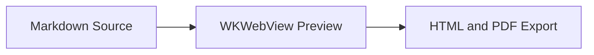

# Rich Markdown

OpenMarked 0.3.0 adds a Markdown Power Pack for technical documents:

- GitHub-style callouts.
- Mermaid diagrams.
- KaTeX math.
- Local link and heading diagnostics.

All Mermaid and KaTeX assets are bundled with the app. Preview, export, print, and visual snapshots do not load Mermaid or KaTeX from a CDN.

## GitHub Callouts

Use GitHub alert syntax inside blockquotes:

```markdown
> [!NOTE]
> Useful context for the reader.

> [!TIP]
> A helpful suggestion.

> [!IMPORTANT]
> Something readers should not miss.

> [!WARNING]
> Something risky or surprising.

> [!CAUTION]
> Something that may cause damage or data loss.
```

Supported callout types are `NOTE`, `TIP`, `IMPORTANT`, `WARNING`, and `CAUTION`. Unknown markers remain normal blockquotes so the document stays readable.

Disable callout rendering in Settings > Rich Markdown if you want the original blockquote text.

## Mermaid Diagrams

Use a fenced code block with the `mermaid` language:

````markdown

````

OpenMarked renders Mermaid diagrams after the sanitized preview HTML loads. The renderer keeps the original Mermaid source in the document output for accessibility and diagnostics.

Common Mermaid diagram types such as flowchart, sequence, class, state, and ER diagrams are expected to work through the bundled Mermaid runtime. Invalid Mermaid source produces an inline error and a diagnostic instead of blanking the whole preview.

Disable Mermaid rendering in Settings > Rich Markdown if you want Mermaid fences to remain as code blocks.

## KaTeX Math

Inline math uses single dollar delimiters:

```markdown
Inline math: $a^2 + b^2 = c^2$.
```

Display math uses double dollar delimiters:

```markdown
$$
\int_0^1 x^2 dx = \frac{1}{3}
$$
```

OpenMarked intentionally avoids common false positives:

- Escaped dollars such as `\$12.00` stay literal.
- Currency-like text such as `$12.00` stays literal.
- Code spans and code fences are ignored.
- Link text is ignored.
- Unmatched delimiters stay readable as text.

Invalid TeX produces a low-noise diagnostic and an inline fallback where possible. Disable math rendering in Settings > Rich Markdown if you want dollar-delimited text to remain literal.

## Link Validation

OpenMarked validates local links during rendering:

- Relative file links are resolved from the source document directory.
- Same-document heading fragments are checked against generated heading IDs.
- Cross-document Markdown heading fragments are checked for readable local Markdown files.
- Unsupported schemes such as `javascript:` are reported.
- Malformed URLs are reported.

Remote HTTP and HTTPS links are parsed, but OpenMarked does not crawl them during normal rendering. If remote link reporting is enabled, remote links produce informational diagnostics explaining that network checking was skipped.

## Render Profiles

Settings include a render profile picker:

- `OpenMarked`: the default profile. It preserves OpenMarked heading slug behavior.
- `GitHub README`: uses GitHub-style heading slugs for compatibility work.

The profile can affect heading IDs and heading-link diagnostics. Use `GitHub README` when checking a document that needs to match GitHub fragment links more closely.

## Export And Print

Standalone HTML export can embed:

- Theme CSS.
- Local images as data URLs.
- The trusted OpenMarked rich-content runtime.
- Bundled Mermaid and KaTeX assets when the document needs them.

PDF export and Print wait for Mermaid and KaTeX rendering before capture. If rich rendering times out or fails, OpenMarked reports a concise status message and keeps diagnostic detail in the diagnostics popover.

## Troubleshooting

Use the diagnostics popover in the status bar when output looks wrong.

Common diagnostics:

- `mermaidRenderFailure`: Mermaid source is empty, malformed, or failed in the runtime.
- `mathRenderFailure`: TeX source is malformed or KaTeX could not render it.
- `malformedGitHubCallout`: a supported callout marker is missing the closing bracket.
- `missingLocalLink`: a relative link points to a missing local file.
- `missingHeadingFragment`: a heading fragment does not match a generated heading ID.
- `unsupportedLinkScheme`: a link uses a scheme OpenMarked will not open from the preview.
- `malformedLink`: a URL is incomplete or malformed.
- `linkValidationSkipped`: remote link network checking was intentionally skipped.

If a rich feature is disabled in Settings, OpenMarked leaves readable fallback content and reports `richContentDisabled`.
