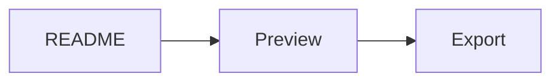

# GitHub README Compatibility Fixture

This fixture approximates README syntax common in GitHub repositories.

> [!IMPORTANT]
> The GitHub profile should keep alert syntax, heading links, task lists, tables, and relative file links predictable.

## Getting Started

- [x] Open a Markdown file.
- [x] Render GitHub Flavored Markdown.
- [ ] Render Mermaid, KaTeX, and callouts.

## Diagram

## Math

The preview can show inline math such as $f(x) = x^2$.

## Relative Links

- [Back to the main fixture](README.md)
- [Jump to getting started](#getting-started)

