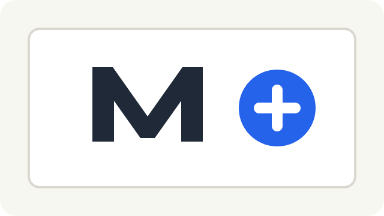

# Link Validation Fixture

This document contains valid local and heading links.

## Existing Heading

- [Same-document heading](#existing-heading)
- [README fixture](README.md)
- [Design document](../../DESIGN.md)
- [Sample image](../Assets/sample-mark.svg)
- [External project](https://example.com/openmarked)
- [Email](mailto:hello@example.com)

