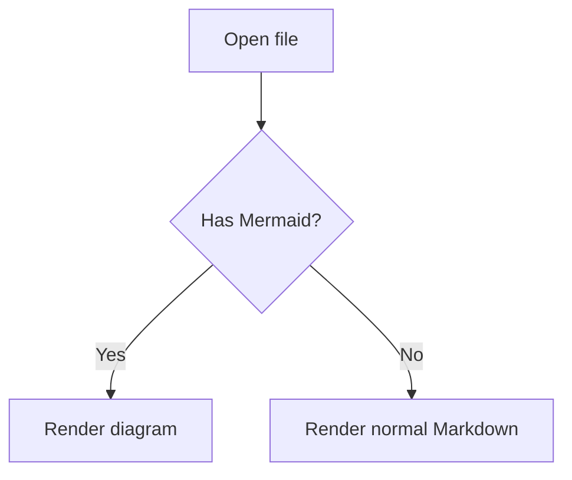
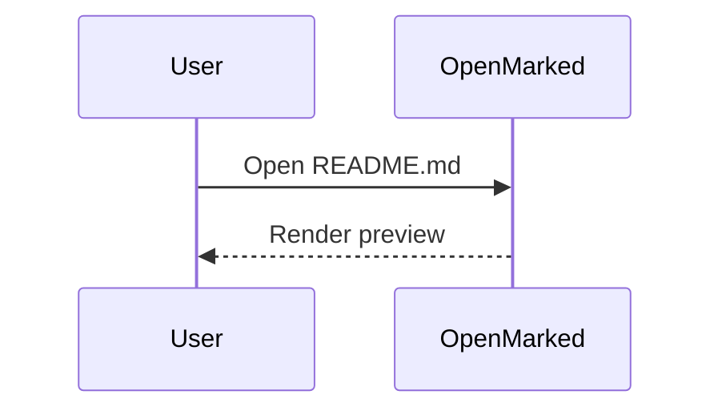
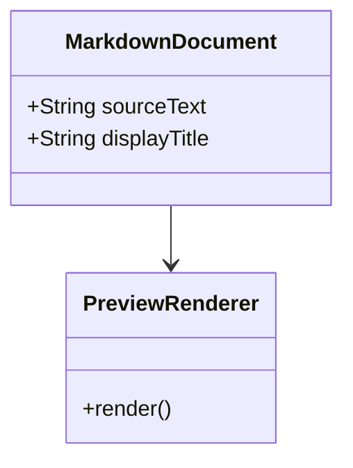
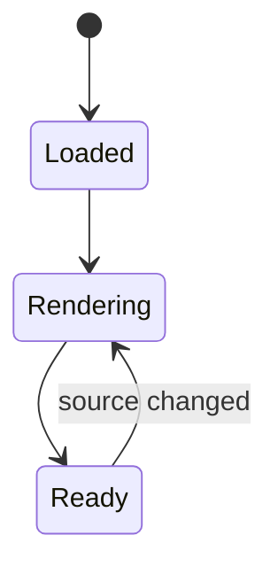
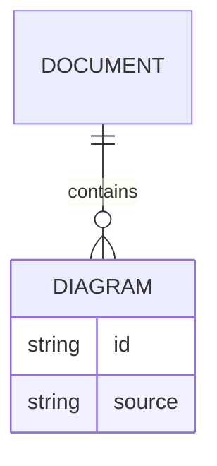

# Mermaid Fixture

OpenMarked 0.3.0 should detect Mermaid code fences before normal code highlighting.

## Flowchart



## Sequence



## Class



## State



## ER



## Broken Diagram

```mermaid
flowchart TD
    A --> 
```

## Ordinary Code

```swift
let language = "swift"
print(language)
```
