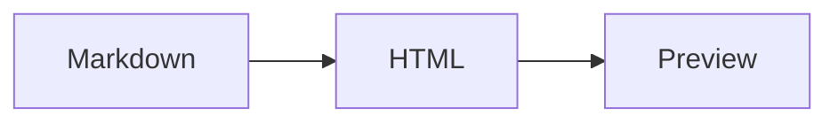

# Rich Statistics Fixture

This document exercises counts for links, images, code, tables, callouts, Mermaid, and math.

## Callout

> [!TIP]
> Use this fixture when a compact document needs many feature types.

## Code

```swift
let message = "OpenMarked"
print(message)
```

## Table

| Column | Value |
| --- | --- |
| Renderer | cmark-gfm |
| Platform | macOS |

## Diagram



## Math

Inline math uses $x + 1$ in prose.

$$
x^2 + y^2 = z^2
$$

## References

[Fixture README](README.md)


