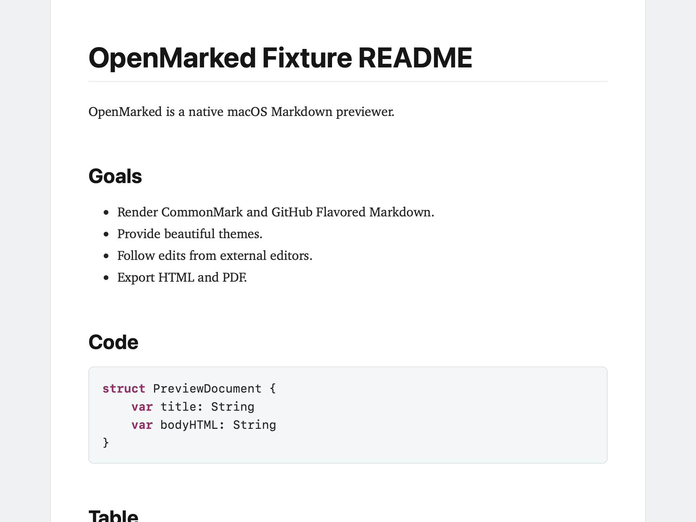
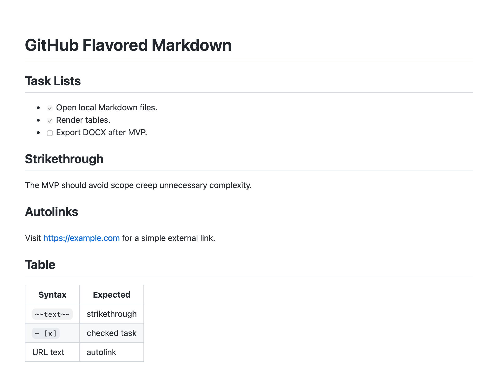
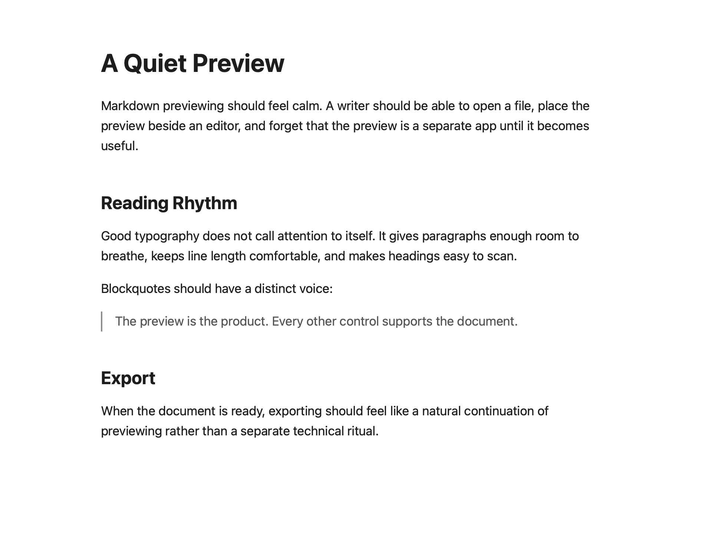

# OpenMarked

OpenMarked is an open source, native macOS Markdown previewer and publishing companion.

The project is currently at `0.2.0`: the MVP is tagged, and the app now has repeatable visual QA, PDF/export artifact checks, README screenshots, ZIP/DMG packaging, and optional Developer ID/notarization hooks.

## Current Status

This repository currently contains:

- Product design: `DESIGN.md`.
- MVP implementation plan: `Docs/MVP_IMPLEMENTATION_PLAN.md`.
- 0.3.0 Markdown Power Pack plan: `Docs/0.3.0_IMPLEMENTATION_PLAN.md`.
- 0.3.0 backlog tracker: `Docs/0.3.0_BACKLOG.md`.
- Rich content dependency policy: `Docs/RICH_CONTENT_DEPENDENCIES.md`.
- Link validation behavior: `Docs/LINK_VALIDATION.md`.
- Roadmap: `ROADMAP.md`.
- Swift Package based native macOS app shell.
- App/window state models for empty, loading, loaded, and error states.
- File open panel, drag/drop file opening, Dock file opening, and recent-document registration.
- Native macOS menu bar, standard app/window commands such as Quit, document commands, keyboard shortcuts, and a compact toolbar.
- Markdown document loading with UTF-8 decoding, line-ending normalization, front matter parsing, source statistics, security-scoped bookmark helpers, and per-document window state persistence.
- Markdown rendering core backed by the system `libcmark-gfm` library, with GFM extensions, footnotes, heading IDs, outline extraction, full HTML assembly, and render diagnostics.
- GitHub alert/callout rendering for note, tip, important, warning, and caution blockquotes in the 0.3.0 development line.
- Local link, heading-fragment, cross-document heading, malformed URL, and unsupported-scheme diagnostics in the 0.3.0 development line.
- Offline Mermaid diagram and KaTeX math rendering in the 0.3.0 development line, using bundled local assets rather than CDN dependencies.
- WKWebView preview loading with document-relative assets, outline navigation, scroll preservation on reload, external-link handling, and preview HTML script sanitization.
- Built-in preview themes, print CSS, font scaling, toolbar/menu theme switching, and offline pre-highlighted code blocks.
- Live preview for external source edits, atomic save replacement, missing-file feedback, local image asset watching, debounce/coalescing, and subtle update status.
- Outline filtering, rendered-preview search, richer status statistics, diagnostics popover, and source file actions.
- Standalone HTML export, copy rendered HTML, PDF export, print, and export error handling.
- A native Settings window for preview defaults, content loading, export defaults, live preview, scroll preservation, and session restoration.
- Keyboard shortcuts for core document, preview, navigation, zoom, search, export, and print actions.
- Accessibility labels for primary controls and states, plus reduced-motion handling for preview navigation/search scrolling.
- Manual QA checklist, release notes, release gate notes, performance smoke coverage, WebKit screenshot baselines, PDF/export artifact checks, and a developer packaging script that creates `OpenMarked.app`, a ZIP artifact, and a DMG.
- Core test target.
- Markdown fixture corpus.
- CI workflow for Swift build, verifier, visual snapshots, export artifacts, and tests.

Signing credentials, notarization, Homebrew Cask, and strict hash-based visual regression enforcement are deferred beyond `0.2.0`. The packaging script supports Developer ID signing and notarization when credentials are available.

## Screenshots







## Platform

- Minimum macOS target: macOS 13.0.
- Language: Swift.
- UI direction: SwiftUI with AppKit where native macOS document/window behavior needs it.
- Preview direction: WKWebView.
- Markdown renderer direction: cmark-gfm behind a Swift abstraction.

## Build and Test

Use Swift Package Manager:

```sh
swift build
swift run OpenMarkedVerifier
swift test
```

Open the package in Xcode by opening `Package.swift`.

Some Command Line Tools only environments do not expose `XCTest` or Swift Testing to SwiftPM. In that case, `swift run OpenMarkedVerifier` provides the local smoke verification, while CI should run `swift test` on a full Xcode runner.

For the full release gate:

```sh
Scripts/verify_release.sh
```

## Developer Packaging

Create a local developer artifact with:

```sh
Scripts/package_release.sh
```

The script builds Release configuration, wraps the executable in `dist/OpenMarked-0.2.0/OpenMarked.app`, copies SwiftPM resources, signs the bundle, verifies the signature, and creates `dist/OpenMarked-0.2.0-macOS.zip` plus `dist/OpenMarked-0.2.0-macOS.dmg`.

By default the app is ad hoc signed. Set `OPENMARKED_SIGN_IDENTITY` to use a Developer ID certificate. Set `OPENMARKED_NOTARIZE=1` with `APPLE_ID`, `APPLE_TEAM_ID`, and `APPLE_APP_SPECIFIC_PASSWORD` to submit the DMG for notarization.

These artifacts are not notarized by default. Gatekeeper behavior is documented in `Docs/RELEASE.md` and `RELEASE_NOTES.md`.

## Usage

Launch the app from Xcode, SwiftPM, or the packaged app. Open one or more Markdown files with File > Open, the toolbar open button, drag and drop, Dock file opening, or Open Recent. When OpenMarked is focused, macOS shows the OpenMarked menu bar with standard commands such as About, Settings, Hide, Quit, Window actions, and the app's Markdown-specific commands. Supported source extensions are `.md`, `.markdown`, `.mdown`, `.mkd`, `.mkdn`, `.txt`, and `.text`.

OpenMarked renders CommonMark plus GitHub Flavored Markdown tables, strikethrough, task lists, autolinks, footnotes, GitHub alert/callout blockquotes, Mermaid diagrams, and KaTeX math through `cmark-gfm` plus OpenMarked postprocessing. It adds stable heading IDs, an outline sidebar, local-image and link diagnostics, document statistics, and offline code highlighting for common MVP languages.

In the `0.3.0` development line, OpenMarked bundles local Mermaid `11.15.0` and KaTeX `0.17.0` resources. Mermaid and KaTeX render offline in preview, PDF/print, snapshots, and standalone HTML export. Supported math delimiters are inline `$...$` and display `$$...$$`; escaped dollars, common currency text, code spans/fences, and link text are kept literal.

Live preview watches the source file and local image references, including common atomic-save workflows. Use View/toolbar controls to toggle the outline, search the rendered preview, change theme, zoom text, reveal the source in Finder, or open the source in the default editor.

Export supports standalone HTML, copying the rendered HTML fragment, PDF export, and native Print. HTML export can embed local images and theme CSS according to Settings, and rich standalone HTML embeds the trusted local Mermaid/KaTeX runtime needed to render diagrams and math offline.

## Settings And Privacy

Settings are available from the app menu and persist with `UserDefaults`. Current preferences cover default theme, default font scale, live updates, scroll preservation, remote image loading, raw HTML rendering, HTML export CSS embedding, local image embedding, and optional restoration of last opened documents.

OpenMarked is designed as a local-first viewer. It does not send document contents to a service. Remote images are loaded only when the setting is enabled; remote scripts and inline event handlers are blocked in preview HTML. Link validation does not crawl remote URLs during normal rendering. Last opened document paths are saved only when session restoration is enabled by the user.

## Known Limitations

The `0.2.0` developer artifact is ad hoc signed but not notarized unless Developer ID credentials are supplied. It does not yet ship as a Homebrew Cask. Print panel behavior still needs a human check before publishing public artifacts. Custom themes, plugin processors, DOCX/EPUB export, grammar tools, and browser integrations are intentionally deferred.

## Feedback

Use the GitHub issue templates for [bug reports](.github/ISSUE_TEMPLATE/bug_report.md), [rendering issues](.github/ISSUE_TEMPLATE/rendering_issue.md), and [feature requests](.github/ISSUE_TEMPLATE/feature_request.md). Rendering issues are most useful with a small Markdown sample and any local assets needed to reproduce the output. See [diagnostics guidance](Docs/DIAGNOSTICS.md) before sharing logs or crash reports.

## MVP Non-Goals

These are intentionally deferred until after the core preview app works well:

- DOCX import/export.
- EPUB export.
- RTF/RTFD import.
- Scrivener project rendering.
- Browser extensions.
- Web page to Markdown conversion.
- Full custom processor/rule engine.
- Plugin API.
- Grammar checking.
- AI features.

## License

OpenMarked is licensed under the GNU General Public License v3.0. See `LICENSE`.
